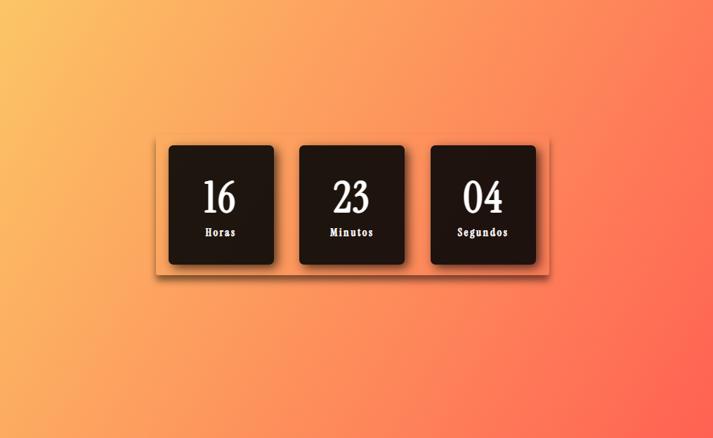

<h1 align="center"> Relógio Digital </h1>

Relógio digital criado com Html, CSS e JavaScript  

  <a href="#-tecnologias">Tecnologias</a>&nbsp;&nbsp;&nbsp;|&nbsp;&nbsp;&nbsp;
  <a href="#-projeto">Projeto</a>&nbsp;&nbsp;&nbsp;|&nbsp;&nbsp;&nbsp;
  <a href="#memo-licença">Licença</a>

  

 

## 🚀 Tecnologias

- Esse projeto foi desenvolvido com as seguintes tecnologias:

- HTML e CSS
- JavaScript
- Git e Github

## 💻 Projeto

- Esse projeto foi criado com o objetivo de por em prática questões envolvendo o JS e a manipulação do DOM. 

- [Visite o projeto online](https://gabnns.github.io/RelogioDigital/) 

## :memo: Licença

Esse projeto está sob a licença MIT.

---
